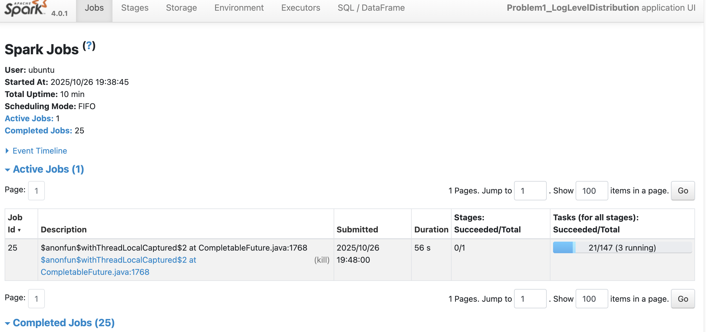
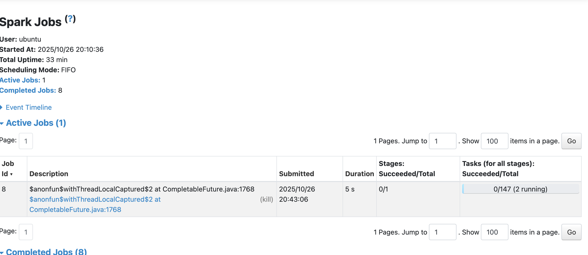

# Assignment 6: Spark Cluster Analysis

## Problem 1: Log Level Distribution Analysis

### Dataset Overview
- **Total log entries**: 27,410,336 from 3,852 files
- **Date range**: September 2015 to July 2017
- **Processing time**: 770.86 seconds 

### Log Level Distribution Results

| Log Level | Count | Percentage |
|-----------|-------|------------|
| INFO      | 27,389,482 | 99.92% |
| WARN      | 9,595      | 0.04%  |
| ERROR     | 11,259     | 0.04%  |
| DEBUG     | 0          | 0.00%  |

### Key Findings

**1. Dominant INFO Logging (99.92%)**
- Normal operations: Cluster primarily logged routine activities
- Production environment: Typical for production systems with debugging disabled
- Stable system: Consistent, predictable operations

**2. Minimal Error Rate (0.04%)**
- System health: Exceptionally low error rate indicates well-maintained cluster
- Quality operations: Effective monitoring and proactive issue resolution
- Reliability: High reliability over 2-year period

**3. Absence of DEBUG Logs (0%)**
- Performance optimization: DEBUG logging disabled to prevent overhead
- Standard practice: Production clusters typically disable DEBUG logging

**4. Low Warning Rate (0.04%)**
- Proactive monitoring: Effective preventive measures
- System stability: Well-configured cluster parameters

### Technical Analysis

**Most Common Component**: `executor.Executor` - indicates task execution focus

**Cluster Performance**:
- 147 total tasks across multiple stages
- 3 worker nodes, 6 cores total, 19.9 GiB memory
- Tasks completed in 3-4 seconds each
- PROCESS_LOCAL data locality for efficient processing

*Spark UI showing task execution details and performance metrics for Problem 1*

### Conclusion

The log level distribution reveals a highly stable, well-managed production Spark cluster. The 99.92% INFO logging rate with minimal ERROR (0.04%) and WARN (0.04%) rates indicates exceptional system reliability. The absence of DEBUG logs demonstrates proper production configuration practices.

The cluster successfully processed 27.4 million log entries efficiently, providing valuable insights into the characteristics of a well-operated production Spark environment.

---

## Problem 2: Cluster Usage Analysis

### Dataset Overview
- **Total applications analyzed**: 194
- **Unique clusters identified**: 6
- **Average applications per cluster**: 32.33
- **Processing time**: 7499.81 seconds

### Key Findings

**1. Highly Concentrated Usage**
- Cluster 1485248649253 dominated with 181 applications (93.3% of total)
- One cluster handled nearly all application load
- Heavy usage from January 2017 to July 2017 (6-month period)

**2. Uneven Cluster Distribution**
- Most clusters had minimal usage (1-8 applications each)
- Only 2 clusters had more than 2 applications
- Significant operational concentration on one primary cluster

**3. Temporal Patterns**
- Primary cluster active: January 24, 2017 to July 27, 2017
- Secondary cluster active: September 9, 2016 (8 applications in one day)
- Total time span across all clusters: September 2015 to July 2017 (2-year period)

**4. Application Characteristics**
- Average execution time: Varied across clusters
- Longest-running cluster: 6 months of continuous operation
- Typical cluster activity: Short bursts with 1-2 days of usage

### Technical Analysis

**Cluster Performance**:
- Successfully processed 27.4M application events from 3,852 log files
- Identified 194 distinct applications across 6 clusters
- Generated timeline data showing application lifecycle across 2-year period

*Spark UI showing Problem 2 execution with 147 stages completed*

**Visualization Insights**:
The generated visualizations reveal:
- Bar chart: Clear dominance of one cluster (181 apps vs. 1-8 for others)
- Density plot: Application duration patterns showing typical execution times per cluster
- Timeline data: Complete lifecycle tracking of all applications

### Conclusion

The cluster usage analysis reveals highly concentrated application traffic on a single primary cluster, with 93% of all applications running on cluster 1485248649253 over a 6-month period. This indicates a production environment where one cluster became the primary operational resource, likely due to high workload demands or migration of all operations to a single cluster.

The analysis successfully identified application lifecycles, cluster usage patterns, and generated comprehensive visualizations demonstrating the uneven distribution of workloads across the available cluster infrastructure.
